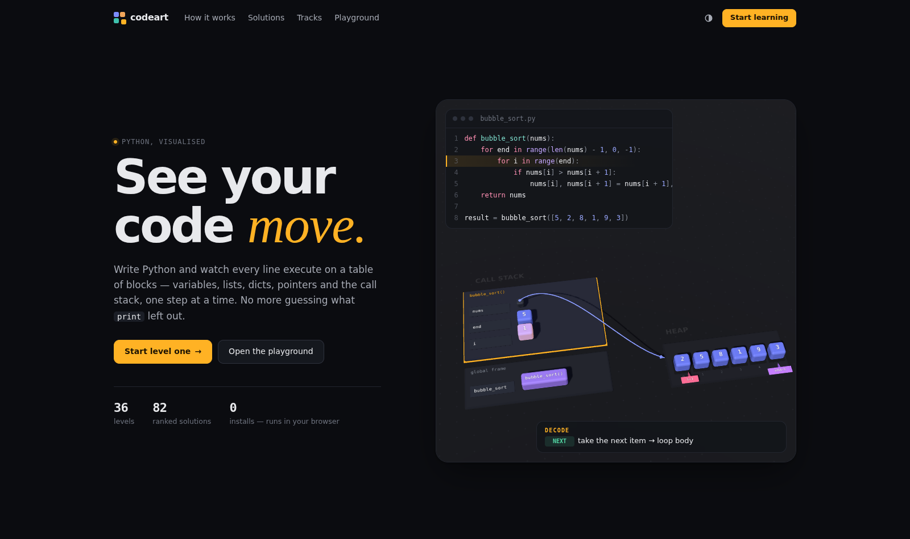
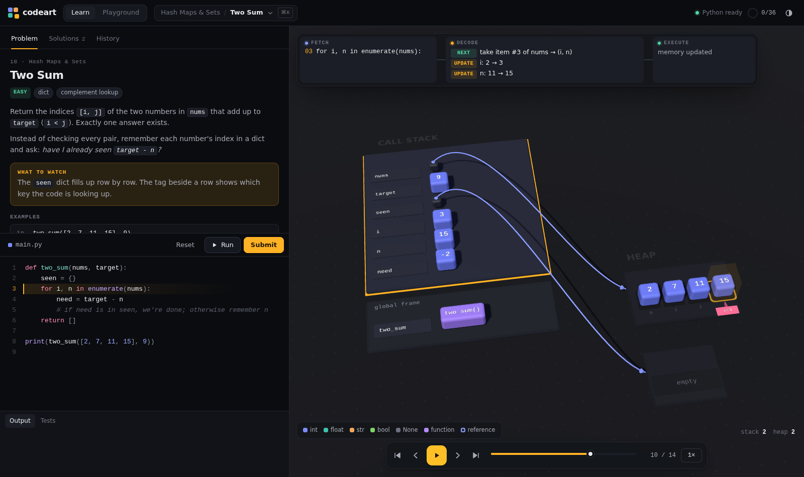
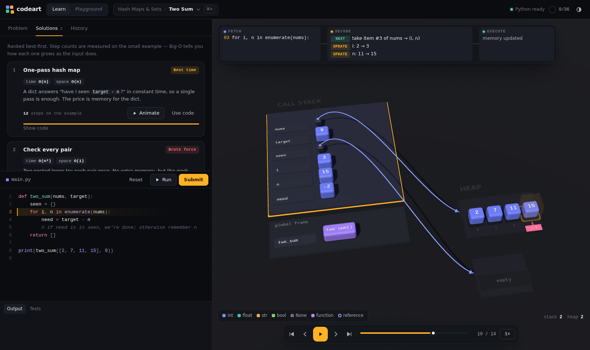
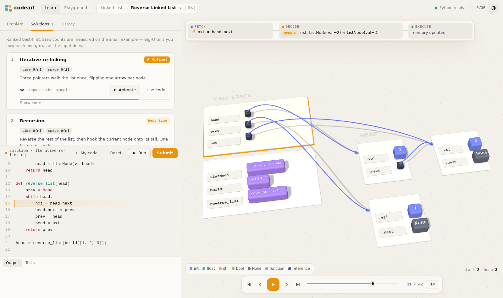

# codeart: see your code move

Write Python and watch it run as 3D blocks on a table. Variables, lists,
dicts, objects and the call stack change one executed line at a time.
This folder is the whole site for **codeart.fun**. Deployment steps are in
[DEPLOY.md](DEPLOY.md).

| | |
| --- | --- |
|  |  |
|  |  |

## Features

- **Fetch / Decode / Execute.** Every step shows the line that runs, a
  plain-English description of what it does to memory (`APPEND`, `SWAP`,
  `LINK`, `CALL`, …), and the animation itself. Play, pause, step or scrub
  backwards.
- **Tabletop memory.**
  - Stack frames sit on the left as trays.
  - Heap objects sit on the right: lists, dicts, sets, strings, grids, and
    class instances (linked lists, trees).
  - References are drawn as arcing arrows; index variables appear as pins
    and `for` loops as a glowing cursor.
- **36 levels in 8 tracks**, from memory basics through two pointers,
  hashing, stacks, sorting, linked lists and trees to dynamic programming.
- **82 ranked solutions**, tiered as *Optimal* / *Best time* / *Best space* /
  *Alternative* / *Brute force*. Each lists its time and space complexity and
  a step count measured on the example. Any solution can be animated.
- **Accounts (optional).** A PHP/MySQL API stores progress, editor drafts
  and every submission. Without the API, everything still works and lives in
  `localStorage`.

## How it works

```
your code ─► py/tracer.py (Pyodide) ─► steps[] ─► js/model.js ─► js/scene.js (Three.js)
             sys.settrace snapshot      JSON       layout + decode   tabletop renderer
             after every line
```

1. **Trace.** `tracer.py` runs the program under `sys.settrace` and records
   a snapshot after every line: frames, reachable heap objects, branch
   outcomes, loop positions and stdout. Step and opcode budgets stop
   infinite loops.
2. **Model.** `model.js` turns each snapshot into keyed scene entities and
   decodes what changed. It has no DOM or WebGL dependency, so Node can
   test it.
3. **Scene.** `scene.js` reconciles entities by key. Blocks that persist
   glide (and hop), new ones drop in, removed ones lift away. Rewinding is
   just reconciling to an earlier step.

## Adding levels (on the way to 200)

Levels are data in `levels/NN-track.js`:

```js
{
  id: 'two-sum', title: 'Two Sum', difficulty: 'Easy', concepts: ['dict'],
  prompt: 'Markdown-lite: `code`, **bold**, *italic*',
  watch: 'What to look for in the animation',
  fn: 'two_sum',                    // the function the tests call
  demo: 'print(two_sum([2, 7, 11, 15], 9))',
  prelude: '',                      // optional shared code (e.g. ListNode)
  starter: `...`,                   // prelude + stub + demo
  solutions: [{ name, tags: ['time', 'space' | 'brute'], time: 'O(n)', space: 'O(1)', idea, code }],
  tests: [{ args: [[2, 7, 11, 15], 9], expected: [0, 1] }],
  // optional: compare ('unordered' | 'unordered_nested' | 'float'), inplace: 0,
  //           pure: true, argTypes: ['linked' | 'tree'], returnType
}
```

Then run the checks:

```sh
node codeart-fun/tools/validate-levels.mjs   # schema, every solution vs tests, traces, layout
node codeart-fun/tools/test-model.mjs        # model smoke test
bash codeart-fun/tools/test-api.sh           # PHP API end-to-end (SQLite)
node codeart-fun/tools/build-hero.mjs        # re-record the landing demo
```
